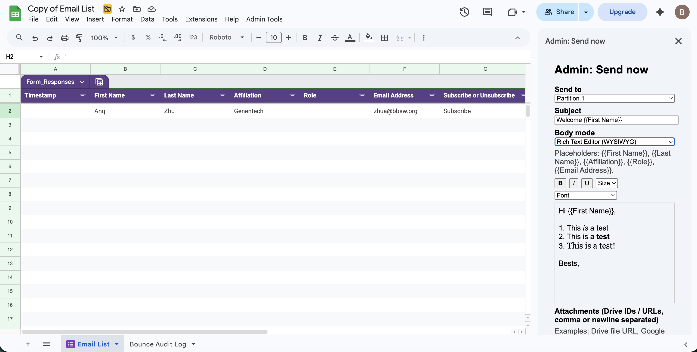

# BBSW Email Management

A Google Apps Script tool for managing email subscriber lists and batch sending campaigns with partition-based rate limiting.

## Features

- **Email List Management**: Subscribe/unsubscribe tracking with automatic deduplication
- **Partitioned Sending**: Distribute emails evenly across partitions to avoid hitting Gmail sending limits
- **Flexible Body Formats**: Support for plain text (auto-converted to HTML), raw HTML, or rich text editing
- **Attachments**: Attach files from Google Drive, public URLs, or upload directly from the sidebar
- **Bounce Auditing**: Automatically detect and remove bounced email addresses from your list
- **Legacy Import**: Import subscriber lists from CSV files with automatic timestamping
- **Re-send Scheduling**: Schedule campaigns to re-send after a configurable delay (default: 7 days)

## License

This project is licensed under the [GNU General Public License v3.0](LICENSE).

You are free to use, modify, and distribute this software — including for
commercial purposes — provided that any distributed version (modified or not)
is also released under GPLv3 with full source code available.

This software is provided "AS IS", without warranty of any kind. See the
LICENSE file for the full disclaimer of warranty and limitation of liability.

## Support and Feedback

This is a volunteer-maintained project — there is no SLA and responses are
best-effort. Feedback, bug reports, and pull requests are very welcome.

- **Bugs or unexpected behavior** → [open an Issue](../../issues/new/choose)
- **"How do I…" questions** → [start a Q&A Discussion](../../discussions)
- **Feature ideas** → [start an Ideas Discussion](../../discussions)
- **Contributing code** → see [CONTRIBUTING.md](CONTRIBUTING.md)
- **Full support policy and what to expect** → see [SUPPORT.md](SUPPORT.md)

## Setup

### 1. Create a Google Sheet

1. Go to [sheets.google.com](https://sheets.google.com)
2. Click **+ Blank** to create a new spreadsheet
3. You can name the spreadsheet anything you like, except that the tool expects a sheet tab named **"Email List"**.

### 2. Access Apps Script

1. In the Google Sheet, click **Extensions** in the top menu
2. Select **Apps Script**
   - A new tab will open with the Apps Script editor
   - You'll see a default `Code.gs` file

### 3. Create Project Files

1. **Delete the default `Code.gs`**: Click the trash icon next to it
2. **Create `Shared.gs`**:
   - Click the **+** button next to "Files"
   - Select **Create new file**
   - Name it `Shared.gs` and click **Create**
   - Copy the entire contents of `Shared.gs` from this repository and paste it
3. **Create `Admin.gs`**:
   - Click the **+** button again
   - Name it `Admin.gs` and click **Create**
   - Copy and paste the contents of `Admin.gs`
4. **Create `Bootstrap.gs`**:
   - Click the **+** button again
   - Name it `Bootstrap.gs` and click **Create**
   - Copy and paste the contents of `Bootstrap.gs`

### 4. Update Configuration

1. In the Apps Script editor, click the **Project Settings** icon (gear icon) on the left sidebar
2. Under **Show advanced settings**, enable **Show "appsscript.json" manifest file in editor**
3. Click on `appsscript.json` in the file list (it should now be visible)
4. Copy the contents from the `appsscript.json` file in this repository and paste it into your project file, replacing the existing content
5. Click **Save**

### 5. Authorize the Script

1. Click **Run** at the top of the editor
2. A pop-up will appear asking for permissions
3. Select your Google account
4. Click **Allow** to grant Gmail and Drive access
5. After authorization completes, close the Apps Script tab

### 6. Create the Email List Sheet

1. In your Google Sheet, click the **+** button at the bottom to add a new sheet
2. Name it **"Email List"** (this name is required by the tool)
3. Add these column headers in row 1:
   - A1: `Timestamp`
   - B1: `First Name`
   - C1: `Last Name`
   - D1: `Affiliation`
   - E1: `Role`
   - F1: `Email Address`
   - G1: `Subscribe or Unsubscribe`
   - H1: `Partition` (optional—created automatically by "Assign/Refresh Partitions")

### 7. Customize Sender Display Name

By default, emails are sent with the display name "BBSW". To change this to your name or organization:

1. In the Apps Script editor, open `appsscript/Admin.gs`
2. Find line 391: `name: 'BBSW'`
3. Replace `'BBSW'` with your preferred name (e.g., `'John Smith'` or `'BBSW Communications'`)
4. Click **Save**
5. Refresh your Google Sheet

The next time you send an email, it will appear from your custom display name. Recipients will see "from: [Your Name] <your-email@gmail.com>" instead of "from: BBSW <your-email@gmail.com>".

### 8. Refresh and Verify

1. **Refresh the page** (or go back to your Google Sheet tab)
2. You should now see the **Admin Tools** menu at the top
3. You're ready to use all admin functions!

## Usage

All features are accessible via the **Admin Tools** menu that appears when you open the spreadsheet.

### Sending Campaigns

#### Send now (Sidebar)

Opens an interactive sidebar to compose and send emails. This is the main interface for campaigns.



##### Step 1: Choose Recipients

**Send to** — Select who receives this email:
- **All subscribers** — Sends to all currently subscribed emails (default)
- **Partition 0, 1, 2, ...** — Sends only to a specific partition. Use this to split large campaigns across multiple sendings to avoid hitting Gmail's rate limits.

##### Step 2: Compose Subject

**Subject** — Email subject line. You can use placeholders like `{{First Name}}` to personalize:
- Example: `Welcome {{First Name}} — BBSW Update`
- Placeholders are replaced with each recipient's data from the Email List

##### Step 3: Choose Body Format

**Body mode** — Controls how your email body is formatted and edited:

- **Plain Text (auto-convert to HTML)** — Best for simple text emails. You type plain text; the script automatically converts it to HTML. Line breaks become paragraphs, multiple line breaks create space. Good for most emails.
  
- **HTML Textarea** — For advanced users. You write raw HTML directly. The script sends it as-is without modifications. Use this if you need fine-grained control over formatting, `<table>` layouts, or custom styling.
  
- **Rich Text Editor (WYSIWYG)** — Visual editor with toolbar. Click the formatting buttons (B, I, U) to bold/italicize/underline selected text. Use the Size and Font dropdowns to change font size and family. Best if you're not comfortable with HTML.

##### Step 4: Format Body Content

Enter your email body in the text area (Plain/HTML) or editor (Rich mode).

**Personalization** — 

In subject and body, use these placeholders to personalize messages:

- `{{First Name}}`
- `{{Last Name}}`
- `{{Affiliation}}`
- `{{Role}}`
- `{{Email Address}}`

Example (Plain Text mode):
```
Hi {{First Name}},

Thank you for subscribing to BBSW updates. Your affiliation is {{Affiliation}} and your role is {{Role}}.

Best regards,
The Team
```

Each recipient sees their own data substituted in place of the placeholders.

##### Adding Images to Email Body (Rich Text Editor Only)

Images can only be embedded in **Rich Text Editor** mode. There are two ways to insert images:

**Option 1: Paste from Clipboard**
1. Copy an image to your clipboard (take a screenshot, right-click an image in your browser and select "Copy image", or copy an image file from Finder)
2. Click into the Rich Text Editor area
3. Press **⌘V** (Mac) or **Ctrl+V** (Windows/Linux)
4. The image will be inserted into the editor

**Option 2: Drag and Drop**
1. Drag an image file from Finder directly into the Rich Text Editor area
2. Or, drag an image from another browser tab into the editor
3. The image will be inserted

##### Step 5: Add Attachments (Optional)

**Attachments (Drive IDs / URLs, comma or newline separated)** — Attach files to the email:

- **Google Drive files** — Paste the file URL: `https://drive.google.com/file/d/1abc123XYZ/view?usp=sharing` or just the file ID
- **Public URLs** — Paste any public link: `https://example.com/document.pdf`
- **Upload files** — Use the "Upload files" input below to pick files directly from your computer (this sending only; not saved)

Examples:
```
https://drive.google.com/file/d/1abc123XYZ/view
1abc123XYZ
https://example.com/flyer.pdf
```

##### Step 6: Send or Save

- **Send** — Sends the campaign to all selected recipients using all attachments (Drive files, URLs, and uploaded files). **The Send action does not modify the Email List sheet** — it will not deduplicate, will not remove unsubscribed addresses, and will not delete failed rows. Clean the list separately before sending if needed (see [Managing Subscribers](#managing-subscribers)). Before sending, the script checks your remaining Gmail quota and warns if it's insufficient.

- **Save inputs** — Stores the subject, body, body mode, and attachments for later. Useful if you want to tweak formatting or use the same email again. **Note:** Only Drive files and URLs are saved; uploaded files are included only in this send and won't be available for re-use.

#### Send now (use saved inputs)

Sends using previously saved subject, body, body mode, partition filter, and attachments (Drive files and URLs only) without opening the sidebar. Useful for quick re-sends. As with the sidebar Send, this **does not modify the Email List sheet**. **Note:** Uploaded files are not saved, so they won't be re-sent — only Drive files and public URLs attached to the saved inputs will be included.

#### Schedule Re-Send in 1 Week

Creates a time-based trigger to automatically re-send the last campaign (same subject, body, attachments, partition filter) after 7 days. The trigger runs in the background and **does not modify the Email List sheet**. Check the Apps Script log (Extensions > Apps Script > Executions) to see when it ran and whether any sends failed.

### Managing Subscribers

Send actions are intentionally non-destructive — they never modify the "Email List" sheet. Use the menu items below to manage the list itself.

#### Recommended pre-send workflow

Before any campaign, run these in order from the **Admin Tools** menu:

1. **Import Unsubscribe List** — if you have new unsubscribe requests to remove.
2. **Clean + Deduplicate (Global)** — collapse duplicates and remove anyone whose latest status is "Unsubscribe".
3. **Assign/Refresh Partitions** — only needed if you added rows; ensures partitions stay balanced.
4. **Audit Bounces (Global)** — optional; clears addresses that bounced from prior campaigns.

Once that's done, open **Send now (Sidebar)** to compose and send.

#### Clean + Deduplicate (Global)

Removes duplicate email entries and unsubscribed addresses from the "Email List" sheet.

How it works:
- Groups all rows by email address (case-insensitive).
- For each email, looks at the row with the **latest Timestamp** (column A).
- If that latest row says **Unsubscribe**, every row for that email is deleted.
- If that latest row says **Subscribe**, only the latest row is kept and older duplicates are deleted.

Run this whenever the list has grown — e.g. after importing a CSV, after a Google Form has added new rows, or after manually editing rows. The script reports how many rows were deleted.

#### Assign/Refresh Partitions

Evenly distributes subscribers across N partitions (default: 4). Adds or refreshes the **Partition** column (column H). Partition sizes differ by at most 1 row.

When to run:
- After importing new subscribers (Legacy CSV import does this automatically).
- After **Set Partition Count** changes the bucket count.
- If you've manually edited or deleted rows and want to rebalance.

**Why this matters:** Apps Script's daily email quota is **100 recipients/day for consumer Gmail** and **1,500/day for Workspace**. If your list exceeds the quota, split sending across multiple days by selecting one partition at a time in the sidebar.

#### Set Partition Count

Prompts for a new partition count between 1 and 26. **Setting the count does not assign partitions** — you must run **Assign/Refresh Partitions** afterward to actually re-bucket the rows.

Tip: divide your list size by your daily quota to get a sensible count. See "How Partitions Work"

#### Import Legacy CSV (from Drive)

Bulk-imports subscriber rows from a CSV stored on Google Drive. Use this when migrating from another tool or seeding a fresh list.

Required CSV columns (exact order, case-insensitive headers):
1. First Name
2. Last Name
3. Email Address
4. Affiliation
5. Role

Steps:
1. Upload your CSV to Google Drive.
2. Get the file's URL (right-click → "Get link" → "Anyone with the link") or copy its file ID.
3. **Admin Tools → Import Legacy CSV (from Drive)**.
4. Paste the URL or file ID. The script will:
   - Parse the CSV, skipping rows with no email address.
   - Assign each row a synthetic "legacy" timestamp from `LEGACY_BASE_ISO` (default: 2000-01-01), incremented by 1 day per import, capped at yesterday.
   - Mark all rows as **Subscribe**.
   - Run **Clean + Deduplicate** automatically.
   - Run **Assign/Refresh Partitions** automatically.

Why the legacy timestamps? They keep imported rows older than any real subscription activity, so newer Subscribe/Unsubscribe rows always win during dedup.

**Reset Legacy Backdate Sequence** — Resets the offset counter back to 0 so the next import starts again at the base date. Useful if you're re-importing from scratch.

#### Import Unsubscribe List

Removes addresses from the list. Two accepted input formats:

- **Pasted addresses** — one per line, or comma/semicolon-separated. Anything containing `@` is treated as an email.
- **Drive CSV** — paste a Google Drive URL or file ID. The CSV must have a column named "Email Address" or "Email" (case-insensitive). If the CSV has only one column, that column is assumed to be emails.

Before deleting, the script shows a confirmation dialog listing the first 20 addresses and asks for YES/NO. Click YES to remove all matching rows from the "Email List" sheet.

#### Audit Bounces (Global)

Scans your Gmail inbox for delivery-failure messages from `mailer-daemon` or "Mail Delivery Subsystem" within the last `BOUNCE_LOOKBACK_DAYS` days (default: 3). Extracts the bounced email addresses from the message bodies and (optionally) deletes them from the list.

Two-step prompt:
1. **Dry Run? (YES/NO)** — Type **YES** to preview only (no deletions). Type **NO** to actually delete. Default is YES.
2. **Optional Gmail Label** — Narrow the Gmail search to a specific label (e.g., `label:CampaignBounces`). Leave blank for no filter.

Results are appended to a separate sheet named **"Bounce Audit Log"** with timestamp, query used, dry-run flag, number found, number removed, and the full email list.

Run this every few days after a campaign, or whenever you notice high bounce rates.

#### Remove All Re-Send Triggers

Deletes all time-based triggers for `adminResendHandler`. Use this if you scheduled a re-send and want to cancel it before it fires. (See [Schedule Re-Send in 1 Week](#schedule-re-send-in-1-week).)

## Configuration

All settings are in `CONFIG` (Shared.gs):

- `SHEET_NAME` — Name of the subscriber list sheet (default: "Email List")
- `RESEND_DELAY_DAYS` — Days to wait before re-send trigger fires (default: 7)
- `BOUNCE_LOOKBACK_DAYS` — Look back N days in Gmail for bounce messages (default: 3)
- `LOG_SHEET_NAME` — Name of the bounce audit log sheet (default: "Bounce Audit Log")
- `LEGACY_BASE_ISO` — Base date for legacy imports (default: 2000-01-01)

## How Partitions Work

Partitions split your list into evenly-sized buckets so you can send to large lists across multiple days without hitting Gmail's daily quota. Partition assignment is deterministic — the same email always lands in the same partition unless you change the partition count.

### Gmail quota reminder

| Account type | Apps Script daily quota |
|---|---|
| Consumer Gmail (`@gmail.com`) | **100 recipients/day** |
| Google Workspace | **1,500 recipients/day** |

Note: this is the Apps Script quota, not the Gmail web UI quota. The script's pre-send check (`MailApp.getRemainingDailyQuota`) will warn you if you're about to exceed it.

### Example: 470 subscribers on consumer Gmail

1. **Admin Tools → Set Partition Count** → enter `5`.
2. **Admin Tools → Assign/Refresh Partitions** — each partition now has ~94 rows.
3. **Day 1:** Send now (Sidebar) → choose "Partition 0" → Send.
4. **Day 2:** Send now (use saved inputs) and switch the filter to Partition 1 — or open the sidebar again and pick "Partition 1".
5. Repeat for partitions 2, 3, 4 over the following days.

Each day stays well under the 100-recipient quota and avoids the bulk-pattern that can trigger Google's account-level send restrictions.

### Alternative: distribute partitions among multiple senders

Instead of one person sending across multiple days, the same partition scheme can be split across multiple Gmail accounts so the whole campaign goes out on the same day. Each sender's quota is independent — five people on consumer Gmail can collectively deliver 500 emails in a single day (5 × 100), and five people on Workspace can deliver up to 7,500.

Workflow:

1. **Owner** — In the shared Google Sheet, run **Set Partition Count** with the number of senders, then **Assign/Refresh Partitions**.
2. **Owner** — Share the spreadsheet with each sender (Editor access). Each sender must also be authorized to run the Apps Script — they will be prompted on their first menu click.
3. **Each sender** — Opens the spreadsheet, goes to **Admin Tools → Send now (Sidebar)**, and:
   - Selects **their assigned partition** (e.g. Alice takes Partition 0, Bob takes Partition 1, etc.).
   - Composes (or pastes) the same subject and body. To keep wording consistent, the owner can send first and click **Save inputs**; other senders can then use **Send now (use saved inputs)** and just change the partition filter.
   - Clicks **Send**. Emails go out from that sender's Gmail account (their address appears in the **From** header).

Warnings:

- **From address differs per sender.** Recipients in partition 0 see Alice's address; recipients in partition 1 see Bob's. That's usually fine for outreach but may not be desirable for a transactional or branded campaign.
- **Attachments uploaded from one sender's computer are not visible to others.** Use Google Drive file IDs or public URLs in the **Attachments** field so every sender attaches the same files.
- **Coordinate via the sheet.** All senders edit the same "Email List" — avoid running **Clean + Deduplicate**, **Assign/Refresh Partitions**, or imports while someone else is mid-send, since deleting rows shifts partition assignments.

## Scripts

- **Bootstrap.gs** — Entry point; defines the Admin Tools menu
- **Admin.gs** — All admin functions: sending, importing, auditing, partitioning
- **Shared.gs** — Configuration and shared utilities: HTML escaping, template rendering, attachment building, sheet operations

## Logs

- All errors and activity are logged to the Apps Script log (View > Logs)
- Bounce audits are also recorded in the "Bounce Audit Log" sheet with timestamp, query, and results

